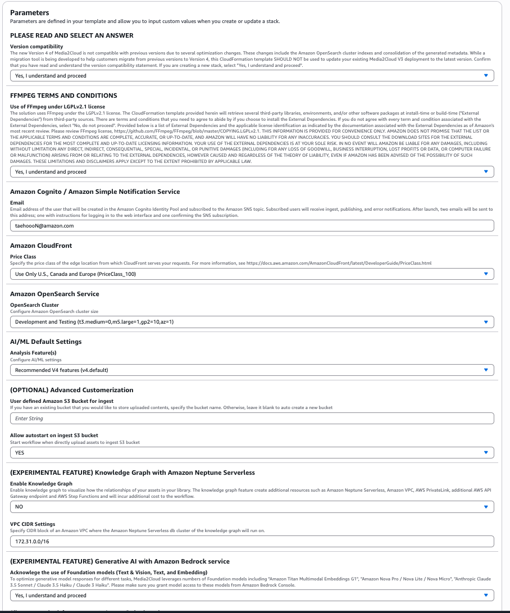
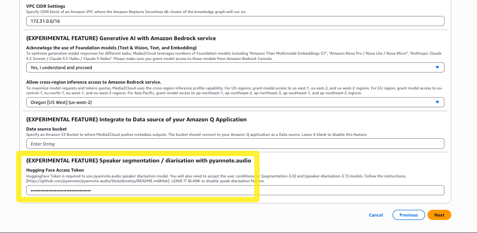

# Media2Cloud v5 설치 가이드

## 개요
Media2Cloud v5 템플릿 설치 방법을 안내합니다.

## 설치 단계

### 1. CloudFormation 템플릿 설정

1. CloudFormation 콘솔에서 템플릿 업로드
2. Parameters 섹션을 아래 이미지와 같이 설정

### 2. Pyannote Audio 모델 접근 권한 설정

#### 2.1 모델 접근 권한 획득
1. https://github.com/pyannote/pyannote-audio/blob/main/README.md#tldr 접속
2. TL;DR 섹션의 **step 2, 3** 작업 수행하여 모델 접근 권한 획득

#### 2.2 Access Token 생성 및 설정
1. TL;DR **4번** 단계에서 access token 생성
2. 생성된 access token을 CloudFormation 템플릿의 마지막 파라미터 필드에 입력

## 주요 파일 위치

- **CloudFormation 템플릿**: `deployment/media2cloud_v5.template`
- **설치 가이드 이미지**: `deployment/guide/`
- **프로젝트 문서**: `readme-v5/`

## 참고 링크

- [Pyannote Audio GitHub](https://github.com/pyannote/pyannote-audio/blob/main/README.md#tldr)
- [AWS CloudFormation 사용자 가이드](https://docs.aws.amazon.com/cloudformation/)

## 문제 해결

설치 중 문제가 발생하면 다음을 확인하세요:

1. Pyannote access token이 올바르게 설정되었는지 확인
2. CloudFormation 파라미터가 모두 정확히 입력되었는지 확인
3. AWS 계정에 필요한 권한이 있는지 확인