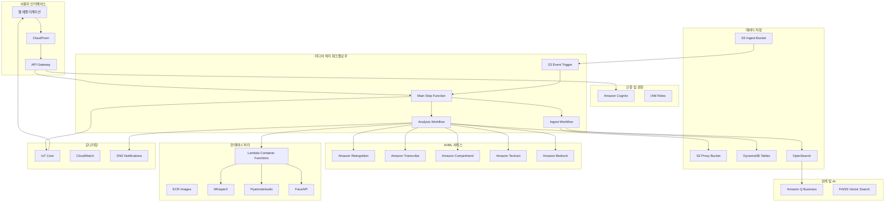
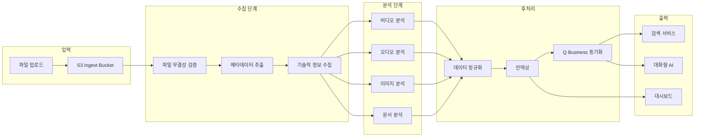
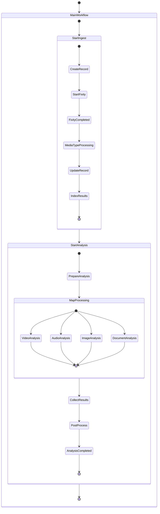
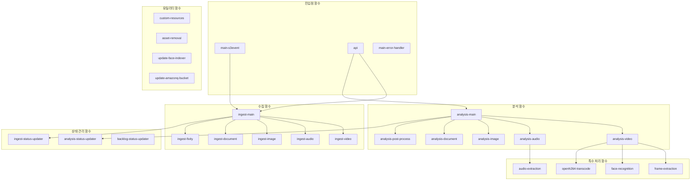
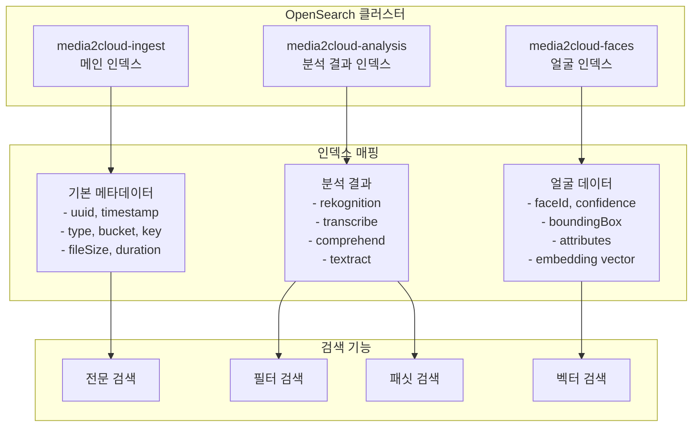
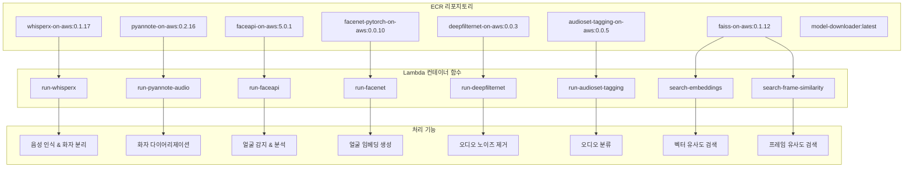
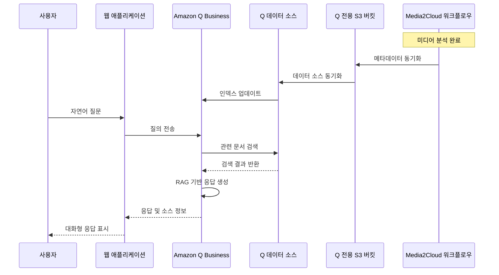
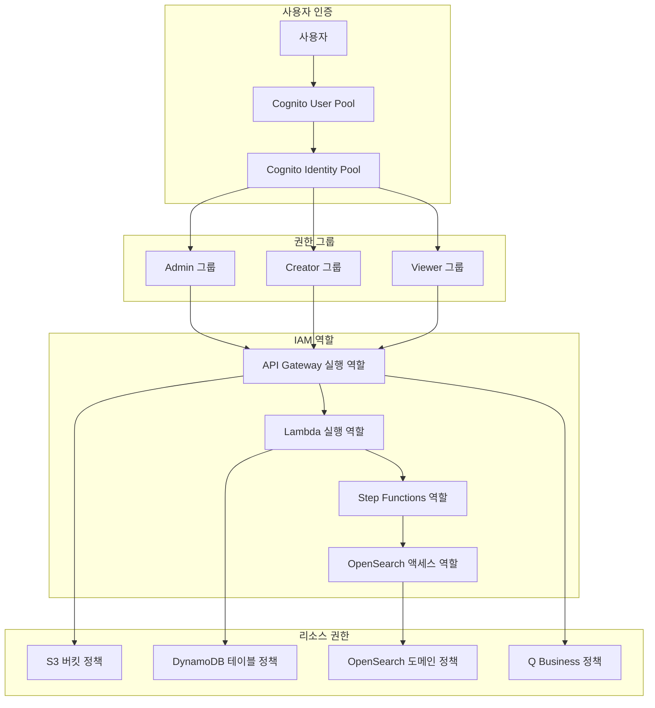

# Media2Cloud v5 시스템 아키텍처 다이어그램

## 1. 전체 시스템 아키텍처



## 2. 데이터 플로우 다이어그램



## 3. CloudFormation 스택 구조

```mermaid
graph TD
    MAIN[메인 스택<br/>media2cloud_v5.template]
    
    MAIN --> CORE[코어 스택<br/>Core Infrastructure]
    MAIN --> WEBAPP[웹앱 스택<br/>Frontend & API]
    MAIN --> BACKEND[백엔드 스택<br/>Lambda & Step Functions]
    MAIN --> CODEBUILD[CodeBuild 스택<br/>Container Images]
    MAIN --> GRAPH[Knowledge Graph 스택<br/>Neptune (선택)]
    MAIN --> AMAZONQ_STACK[Amazon Q 스택<br/>Q Business (선택)]

    subgraph "코어 스택 리소스"
        CORE --> S3_BUCKETS[S3 Buckets]
        CORE --> OPENSEARCH_CLUSTER[OpenSearch Cluster]
        CORE --> LAMBDA_LAYERS[Lambda Layers]
        CORE --> IOT_RESOURCES[IoT Core Resources]
    end

    subgraph "웹앱 스택 리소스"
        WEBAPP --> API_GATEWAY[API Gateway]
        WEBAPP --> COGNITO_RESOURCES[Cognito User Pool]
        WEBAPP --> CLOUDFRONT_DIST[CloudFront Distribution]
    end

    subgraph "백엔드 스택 리소스"
        BACKEND --> LAMBDA_FUNCTIONS[Lambda Functions]
        BACKEND --> STEP_FUNCTIONS[Step Functions]
        BACKEND --> DYNAMODB_TABLES[DynamoDB Tables]
        BACKEND --> SNS_TOPICS[SNS Topics]
    end

    subgraph "CodeBuild 스택 리소스"
        CODEBUILD --> ECR_REPOS[ECR Repositories]
        CODEBUILD --> BUILD_PROJECTS[CodeBuild Projects]
        CODEBUILD --> CONTAINER_IMAGES[Container Images]
    end
```

## 4. Step Functions 워크플로우 구조



## 5. Lambda 함수 관계도



## 6. DynamoDB 테이블 관계도

```mermaid
erDiagram
    INGEST_TABLE {
        string uuid PK
        number timestamp
        string type
        string bucket
        string key
        number fileSize
        number duration
        string overallStatus
        number progress
        json input
        json data
    }
    
    ANALYSIS_TABLE {
        string uuid PK
        number timestamp
        string overallStatus
        number progress
        string executionArn
        json data
    }
    
    FACE_INDEXER_TABLE {
        string uuid PK
        string faceId SK
        string collectionId
        string externalImageId
        json boundingBox
        number confidence
        json landmarks
        json attributes
        number timestamp
    }
    
    BACKLOG_TABLE {
        string id PK
        string type
        string status
        number priority
        string uuid
        json input
        number createdAt
        number updatedAt
        number retryCount
        number maxRetries
    }
    
    INGEST_TABLE ||--|| ANALYSIS_TABLE : "uuid"
    ANALYSIS_TABLE ||--o{ FACE_INDEXER_TABLE : "uuid"
    INGEST_TABLE ||--o{ BACKLOG_TABLE : "uuid"
```

## 7. OpenSearch 인덱스 구조



## 8. ECR 컨테이너 이미지 구조



## 9. Amazon Q Business 통합 구조



## 10. 보안 및 권한 구조

