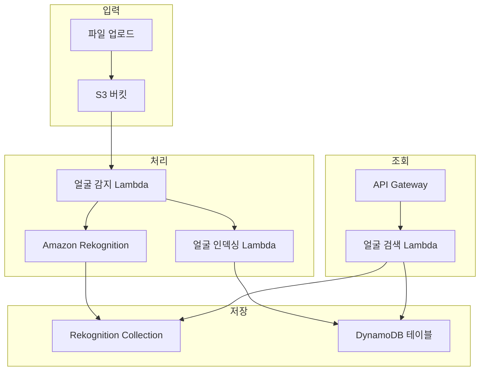

# Face Indexing 최소 구성 가이드

## 1. 최소 구성 개요

Face Indexing 기능만을 구현하기 위한 최소한의 AWS 리소스와 구성 요소입니다.

### 1.1 필수 AWS 서비스
- **Amazon S3**: 이미지/비디오 파일 저장
- **Amazon Rekognition**: 얼굴 감지 및 인덱싱
- **Amazon DynamoDB**: 얼굴 메타데이터 저장
- **AWS Lambda**: 처리 로직
- **Amazon API Gateway**: REST API 제공

### 1.2 아키텍처 다이어그램


## 2. CloudFormation 최소 템플릿

```yaml
AWSTemplateFormatVersion: '2010-09-09'
Description: 'Face Indexing 최소 구성'

Parameters:
  BucketName:
    Type: String
    Default: face-indexing-bucket
  CollectionId:
    Type: String
    Default: face-collection

Resources:
  # S3 버킷
  MediaBucket:
    Type: AWS::S3::Bucket
    Properties:
      BucketName: !Sub "${BucketName}-${AWS::AccountId}"
      NotificationConfiguration:
        LambdaConfigurations:
          - Event: s3:ObjectCreated:*
            Function: !GetAtt FaceDetectionLambda.Arn
            Filter:
              S3Key:
                Rules:
                  - Name: suffix
                    Value: .jpg
                  - Name: suffix
                    Value: .png
                  - Name: suffix
                    Value: .mp4

  # DynamoDB 테이블
  FaceIndexTable:
    Type: AWS::DynamoDB::Table
    Properties:
      TableName: !Sub "face-index-${AWS::StackName}"
      BillingMode: PAY_PER_REQUEST
      AttributeDefinitions:
        - AttributeName: faceId
          AttributeType: S
        - AttributeName: imageId
          AttributeType: S
      KeySchema:
        - AttributeName: faceId
          KeyType: HASH
      GlobalSecondaryIndexes:
        - IndexName: imageId-index
          KeySchema:
            - AttributeName: imageId
              KeyType: HASH
          Projection:
            ProjectionType: ALL

  # Lambda 실행 역할
  LambdaExecutionRole:
    Type: AWS::IAM::Role
    Properties:
      AssumeRolePolicyDocument:
        Version: '2012-10-17'
        Statement:
          - Effect: Allow
            Principal:
              Service: lambda.amazonaws.com
            Action: sts:AssumeRole
      ManagedPolicyArns:
        - arn:aws:iam::aws:policy/service-role/AWSLambdaBasicExecutionRole
      Policies:
        - PolicyName: FaceIndexingPolicy
          PolicyDocument:
            Version: '2012-10-17'
            Statement:
              - Effect: Allow
                Action:
                  - rekognition:*
                  - dynamodb:*
                  - s3:GetObject
                Resource: '*'

  # 얼굴 감지 Lambda
  FaceDetectionLambda:
    Type: AWS::Lambda::Function
    Properties:
      FunctionName: !Sub "face-detection-${AWS::StackName}"
      Runtime: python3.9
      Handler: index.handler
      Role: !GetAtt LambdaExecutionRole.Arn
      Environment:
        Variables:
          COLLECTION_ID: !Ref CollectionId
          TABLE_NAME: !Ref FaceIndexTable
      Code:
        ZipFile: |
          import json
          import boto3
          import os
          from urllib.parse import unquote_plus

          rekognition = boto3.client('rekognition')
          dynamodb = boto3.resource('dynamodb')
          table = dynamodb.Table(os.environ['TABLE_NAME'])
          collection_id = os.environ['COLLECTION_ID']

          def handler(event, context):
              for record in event['Records']:
                  bucket = record['s3']['bucket']['name']
                  key = unquote_plus(record['s3']['object']['key'])
                  
                  try:
                      # 얼굴 인덱싱
                      response = rekognition.index_faces(
                          CollectionId=collection_id,
                          Image={'S3Object': {'Bucket': bucket, 'Name': key}},
                          ExternalImageId=key,
                          MaxFaces=10,
                          QualityFilter='AUTO'
                      )
                      
                      # DynamoDB에 저장
                      for face_record in response['FaceRecords']:
                          face_id = face_record['Face']['FaceId']
                          table.put_item(
                              Item={
                                  'faceId': face_id,
                                  'imageId': key,
                                  'bucket': bucket,
                                  'confidence': face_record['Face']['Confidence'],
                                  'boundingBox': face_record['Face']['BoundingBox']
                              }
                          )
                      
                      print(f"Indexed {len(response['FaceRecords'])} faces from {key}")
                      
                  except Exception as e:
                      print(f"Error processing {key}: {str(e)}")
              
              return {'statusCode': 200}

  # 얼굴 검색 Lambda
  FaceSearchLambda:
    Type: AWS::Lambda::Function
    Properties:
      FunctionName: !Sub "face-search-${AWS::StackName}"
      Runtime: python3.9
      Handler: index.handler
      Role: !GetAtt LambdaExecutionRole.Arn
      Environment:
        Variables:
          COLLECTION_ID: !Ref CollectionId
          TABLE_NAME: !Ref FaceIndexTable
      Code:
        ZipFile: |
          import json
          import boto3
          import os
          import base64

          rekognition = boto3.client('rekognition')
          dynamodb = boto3.resource('dynamodb')
          table = dynamodb.Table(os.environ['TABLE_NAME'])
          collection_id = os.environ['COLLECTION_ID']

          def handler(event, context):
              try:
                  # API Gateway에서 이미지 데이터 받기
                  image_data = base64.b64decode(event['body'])
                  
                  # 얼굴 검색
                  response = rekognition.search_faces_by_image(
                      CollectionId=collection_id,
                      Image={'Bytes': image_data},
                      MaxFaces=10,
                      FaceMatchThreshold=80
                  )
                  
                  results = []
                  for match in response['FaceMatches']:
                      face_id = match['Face']['FaceId']
                      
                      # DynamoDB에서 상세 정보 조회
                      db_response = table.get_item(Key={'faceId': face_id})
                      if 'Item' in db_response:
                          item = db_response['Item']
                          results.append({
                              'faceId': face_id,
                              'similarity': match['Similarity'],
                              'imageId': item['imageId'],
                              'bucket': item['bucket'],
                              'confidence': item['confidence']
                          })
                  
                  return {
                      'statusCode': 200,
                      'headers': {'Content-Type': 'application/json'},
                      'body': json.dumps({'matches': results})
                  }
                  
              except Exception as e:
                  return {
                      'statusCode': 500,
                      'body': json.dumps({'error': str(e)})
                  }

  # API Gateway
  FaceSearchApi:
    Type: AWS::ApiGateway::RestApi
    Properties:
      Name: !Sub "face-search-api-${AWS::StackName}"
      Description: Face Search API

  FaceSearchResource:
    Type: AWS::ApiGateway::Resource
    Properties:
      RestApiId: !Ref FaceSearchApi
      ParentId: !GetAtt FaceSearchApi.RootResourceId
      PathPart: search

  FaceSearchMethod:
    Type: AWS::ApiGateway::Method
    Properties:
      RestApiId: !Ref FaceSearchApi
      ResourceId: !Ref FaceSearchResource
      HttpMethod: POST
      AuthorizationType: NONE
      Integration:
        Type: AWS_PROXY
        IntegrationHttpMethod: POST
        Uri: !Sub "arn:aws:apigateway:${AWS::Region}:lambda:path/2015-03-31/functions/${FaceSearchLambda.Arn}/invocations"

  # Lambda 권한
  S3InvokePermission:
    Type: AWS::Lambda::Permission
    Properties:
      FunctionName: !Ref FaceDetectionLambda
      Action: lambda:InvokeFunction
      Principal: s3.amazonaws.com
      SourceArn: !Sub "${MediaBucket}/*"

  ApiInvokePermission:
    Type: AWS::Lambda::Permission
    Properties:
      FunctionName: !Ref FaceSearchLambda
      Action: lambda:InvokeFunction
      Principal: apigateway.amazonaws.com
      SourceArn: !Sub "${FaceSearchApi}/*/*"

  # API 배포
  ApiDeployment:
    Type: AWS::ApiGateway::Deployment
    DependsOn: FaceSearchMethod
    Properties:
      RestApiId: !Ref FaceSearchApi
      StageName: prod

Outputs:
  BucketName:
    Value: !Ref MediaBucket
  ApiEndpoint:
    Value: !Sub "https://${FaceSearchApi}.execute-api.${AWS::Region}.amazonaws.com/prod"
  CollectionId:
    Value: !Ref CollectionId
```

## 3. 배포 및 설정

### 3.1 Rekognition Collection 생성
```bash
# Collection 생성
aws rekognition create-collection --collection-id face-collection

# Collection 확인
aws rekognition list-collections
```

### 3.2 CloudFormation 배포
```bash
# 스택 배포
aws cloudformation create-stack \
  --stack-name face-indexing-stack \
  --template-body file://face-indexing-template.yaml \
  --capabilities CAPABILITY_IAM \
  --parameters ParameterKey=CollectionId,ParameterValue=face-collection

# 배포 상태 확인
aws cloudformation describe-stacks --stack-name face-indexing-stack
```

## 4. 사용 방법

### 4.1 이미지 업로드 (얼굴 인덱싱)
```bash
# S3에 이미지 업로드 (자동으로 얼굴 인덱싱 실행)
aws s3 cp person1.jpg s3://face-indexing-bucket-123456789012/
aws s3 cp person2.jpg s3://face-indexing-bucket-123456789012/
```

### 4.2 얼굴 검색 API 호출
```python
import requests
import base64

# 이미지 파일을 base64로 인코딩
with open('search_image.jpg', 'rb') as f:
    image_data = base64.b64encode(f.read()).decode('utf-8')

# API 호출
api_endpoint = "https://your-api-id.execute-api.region.amazonaws.com/prod/search"
response = requests.post(api_endpoint, data=image_data)

print(response.json())
```

### 4.3 JavaScript 예시
```javascript
// 파일 업로드 및 검색
async function searchFace(imageFile) {
    const reader = new FileReader();
    
    reader.onload = async function(e) {
        const base64Data = e.target.result.split(',')[1];
        
        const response = await fetch('https://your-api-endpoint/search', {
            method: 'POST',
            body: base64Data,
            headers: {
                'Content-Type': 'application/json'
            }
        });
        
        const result = await response.json();
        console.log('검색 결과:', result.matches);
    };
    
    reader.readAsDataURL(imageFile);
}
```

## 5. 모니터링 및 로깅

### 5.1 CloudWatch 로그 확인
```bash
# Lambda 로그 확인
aws logs describe-log-groups --log-group-name-prefix "/aws/lambda/face-"

# 로그 스트림 확인
aws logs get-log-events --log-group-name "/aws/lambda/face-detection-stack" --log-stream-name "latest"
```

### 5.2 DynamoDB 데이터 확인
```bash
# 테이블 스캔
aws dynamodb scan --table-name face-index-stack

# 특정 얼굴 ID 조회
aws dynamodb get-item \
  --table-name face-index-stack \
  --key '{"faceId":{"S":"your-face-id"}}'
```

## 6. 확장 옵션

### 6.1 웹 인터페이스 추가
```html
<!DOCTYPE html>
<html>
<head>
    <title>Face Search</title>
</head>
<body>
    <h1>얼굴 검색</h1>
    <input type="file" id="imageInput" accept="image/*">
    <button onclick="searchFace()">검색</button>
    <div id="results"></div>

    <script>
        async function searchFace() {
            const file = document.getElementById('imageInput').files[0];
            if (!file) return;

            const reader = new FileReader();
            reader.onload = async function(e) {
                const base64Data = e.target.result.split(',')[1];
                
                try {
                    const response = await fetch('YOUR_API_ENDPOINT/search', {
                        method: 'POST',
                        body: base64Data
                    });
                    
                    const result = await response.json();
                    document.getElementById('results').innerHTML = 
                        JSON.stringify(result, null, 2);
                } catch (error) {
                    console.error('Error:', error);
                }
            };
            reader.readAsDataURL(file);
        }
    </script>
</body>
</html>
```

### 6.2 비디오 지원 추가
```python
# 비디오에서 프레임 추출 후 얼굴 인덱싱
import cv2

def extract_frames_and_index(video_path, interval=30):
    """비디오에서 30초마다 프레임 추출하여 얼굴 인덱싱"""
    cap = cv2.VideoCapture(video_path)
    fps = cap.get(cv2.CAP_PROP_FPS)
    frame_interval = int(fps * interval)
    
    frame_count = 0
    while True:
        ret, frame = cap.read()
        if not ret:
            break
            
        if frame_count % frame_interval == 0:
            # 프레임을 이미지로 저장하고 S3 업로드
            frame_filename = f"frame_{frame_count}.jpg"
            cv2.imwrite(frame_filename, frame)
            # S3 업로드 로직 추가
            
        frame_count += 1
    
    cap.release()
```

## 7. 보안 고려사항

### 7.1 API 보안 강화
```yaml
# Cognito 인증 추가
FaceSearchMethod:
  Type: AWS::ApiGateway::Method
  Properties:
    AuthorizationType: COGNITO_USER_POOLS
    AuthorizerId: !Ref CognitoAuthorizer
```

### 7.2 S3 버킷 보안
```yaml
# S3 버킷 정책
MediaBucketPolicy:
  Type: AWS::S3::BucketPolicy
  Properties:
    Bucket: !Ref MediaBucket
    PolicyDocument:
      Statement:
        - Effect: Deny
          Principal: "*"
          Action: "s3:*"
          Resource: 
            - !Sub "${MediaBucket}/*"
            - !Ref MediaBucket
          Condition:
            Bool:
              "aws:SecureTransport": "false"
```

이 최소 구성으로 Face Indexing 기능을 구현할 수 있으며, 필요에 따라 점진적으로 기능을 확장할 수 있습니다.