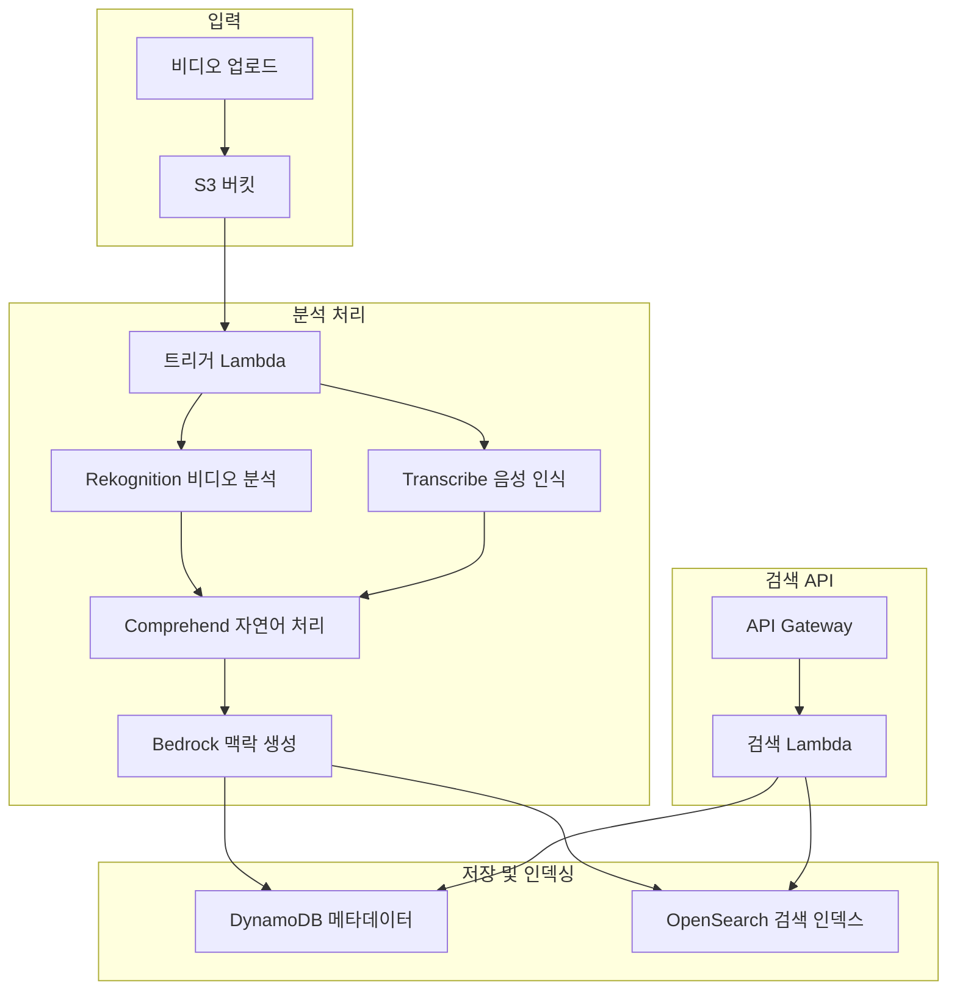

# 비디오 맥락 및 장면 분석 최소 구성 가이드

## 1. 최소 구성 개요

비디오의 맥락과 장면 정보를 자동으로 생성하고 검색하는 기능을 위한 최소한의 AWS 리소스 구성입니다.

### 1.1 필수 AWS 서비스
- **Amazon S3**: 비디오 파일 저장
- **Amazon Rekognition**: 비디오 분석 (객체, 장면, 텍스트)
- **Amazon Transcribe**: 음성-텍스트 변환
- **Amazon Comprehend**: 자연어 처리 (키워드, 감정)
- **Amazon Bedrock**: 맥락 요약 생성
- **Amazon OpenSearch**: 검색 인덱싱
- **AWS Lambda**: 처리 로직
- **Amazon API Gateway**: REST API

### 1.2 아키텍처 다이어그램


## 2. CloudFormation 템플릿

```yaml
AWSTemplateFormatVersion: '2010-09-09'
Description: '비디오 맥락 및 장면 분석 최소 구성'

Parameters:
  BucketName:
    Type: String
    Default: video-context-analysis
  OpenSearchDomain:
    Type: String
    Default: video-search

Resources:
  # S3 버킷
  VideoBucket:
    Type: AWS::S3::Bucket
    Properties:
      BucketName: !Sub "${BucketName}-${AWS::AccountId}"
      NotificationConfiguration:
        LambdaConfigurations:
          - Event: s3:ObjectCreated:*
            Function: !GetAtt VideoAnalysisLambda.Arn
            Filter:
              S3Key:
                Rules:
                  - Name: suffix
                    Value: .mp4
                  - Name: suffix
                    Value: .mov
                  - Name: suffix
                    Value: .avi

  # DynamoDB 테이블
  VideoMetadataTable:
    Type: AWS::DynamoDB::Table
    Properties:
      TableName: !Sub "video-metadata-${AWS::StackName}"
      BillingMode: PAY_PER_REQUEST
      AttributeDefinitions:
        - AttributeName: videoId
          AttributeType: S
        - AttributeName: timestamp
          AttributeType: N
      KeySchema:
        - AttributeName: videoId
          KeyType: HASH
      GlobalSecondaryIndexes:
        - IndexName: timestamp-index
          KeySchema:
            - AttributeName: timestamp
              KeyType: HASH
          Projection:
            ProjectionType: ALL

  # OpenSearch 도메인
  OpenSearchDomain:
    Type: AWS::OpenSearch::Domain
    Properties:
      DomainName: !Sub "${OpenSearchDomain}-${AWS::StackName}"
      EngineVersion: OpenSearch_2.3
      ClusterConfig:
        InstanceType: t3.small.search
        InstanceCount: 1
      EBSOptions:
        EBSEnabled: true
        VolumeType: gp3
        VolumeSize: 10
      AccessPolicies:
        Version: '2012-10-17'
        Statement:
          - Effect: Allow
            Principal:
              AWS: !Sub "arn:aws:iam::${AWS::AccountId}:root"
            Action: "es:*"
            Resource: !Sub "arn:aws:es:${AWS::Region}:${AWS::AccountId}:domain/${OpenSearchDomain}-${AWS::StackName}/*"

  # Lambda 실행 역할
  LambdaExecutionRole:
    Type: AWS::IAM::Role
    Properties:
      AssumeRolePolicyDocument:
        Version: '2012-10-17'
        Statement:
          - Effect: Allow
            Principal:
              Service: lambda.amazonaws.com
            Action: sts:AssumeRole
      ManagedPolicyArns:
        - arn:aws:iam::aws:policy/service-role/AWSLambdaBasicExecutionRole
      Policies:
        - PolicyName: VideoAnalysisPolicy
          PolicyDocument:
            Version: '2012-10-17'
            Statement:
              - Effect: Allow
                Action:
                  - rekognition:*
                  - transcribe:*
                  - comprehend:*
                  - bedrock:InvokeModel
                  - dynamodb:*
                  - es:*
                  - s3:GetObject
                Resource: '*'

  # 비디오 분석 Lambda
  VideoAnalysisLambda:
    Type: AWS::Lambda::Function
    Properties:
      FunctionName: !Sub "video-analysis-${AWS::StackName}"
      Runtime: python3.9
      Handler: index.handler
      Role: !GetAtt LambdaExecutionRole.Arn
      Timeout: 900
      Environment:
        Variables:
          TABLE_NAME: !Ref VideoMetadataTable
          OPENSEARCH_ENDPOINT: !GetAtt OpenSearchDomain.DomainEndpoint
      Code:
        ZipFile: |
          import json
          import boto3
          import os
          import uuid
          from urllib.parse import unquote_plus
          from datetime import datetime

          rekognition = boto3.client('rekognition')
          transcribe = boto3.client('transcribe')
          comprehend = boto3.client('comprehend')
          bedrock = boto3.client('bedrock-runtime')
          dynamodb = boto3.resource('dynamodb')
          opensearch = boto3.client('opensearchserverless')

          table = dynamodb.Table(os.environ['TABLE_NAME'])
          opensearch_endpoint = os.environ['OPENSEARCH_ENDPOINT']

          def handler(event, context):
              for record in event['Records']:
                  bucket = record['s3']['bucket']['name']
                  key = unquote_plus(record['s3']['object']['key'])
                  video_id = str(uuid.uuid4())
                  
                  try:
                      # 1. Rekognition 비디오 분석 시작
                      rekognition_jobs = start_rekognition_analysis(bucket, key, video_id)
                      
                      # 2. Transcribe 작업 시작
                      transcribe_job = start_transcribe_job(bucket, key, video_id)
                      
                      # 3. 초기 메타데이터 저장
                      save_initial_metadata(video_id, bucket, key, rekognition_jobs, transcribe_job)
                      
                      print(f"Started analysis for video: {video_id}")
                      
                  except Exception as e:
                      print(f"Error processing {key}: {str(e)}")
              
              return {'statusCode': 200}

          def start_rekognition_analysis(bucket, key, video_id):
              jobs = {}
              
              # 객체 감지
              response = rekognition.start_label_detection(
                  Video={'S3Object': {'Bucket': bucket, 'Name': key}},
                  ClientRequestToken=f"{video_id}-labels"
              )
              jobs['labels'] = response['JobId']
              
              # 장면 분할
              response = rekognition.start_segment_detection(
                  Video={'S3Object': {'Bucket': bucket, 'Name': key}},
                  SegmentTypes=['TECHNICAL_CUE', 'SHOT'],
                  ClientRequestToken=f"{video_id}-segments"
              )
              jobs['segments'] = response['JobId']
              
              # 텍스트 감지
              response = rekognition.start_text_detection(
                  Video={'S3Object': {'Bucket': bucket, 'Name': key}},
                  ClientRequestToken=f"{video_id}-text"
              )
              jobs['text'] = response['JobId']
              
              return jobs

          def start_transcribe_job(bucket, key, video_id):
              job_name = f"transcribe-{video_id}"
              
              response = transcribe.start_transcription_job(
                  TranscriptionJobName=job_name,
                  Media={'MediaFileUri': f"s3://{bucket}/{key}"},
                  MediaFormat='mp4',
                  LanguageCode='ko-KR',
                  Settings={
                      'ShowSpeakerLabels': True,
                      'MaxSpeakerLabels': 10
                  }
              )
              
              return job_name

          def save_initial_metadata(video_id, bucket, key, rekognition_jobs, transcribe_job):
              table.put_item(
                  Item={
                      'videoId': video_id,
                      'bucket': bucket,
                      'key': key,
                      'timestamp': int(datetime.now().timestamp()),
                      'status': 'PROCESSING',
                      'rekognitionJobs': rekognition_jobs,
                      'transcribeJob': transcribe_job,
                      'createdAt': datetime.now().isoformat()
                  }
              )

  # 결과 처리 Lambda
  ResultProcessorLambda:
    Type: AWS::Lambda::Function
    Properties:
      FunctionName: !Sub "result-processor-${AWS::StackName}"
      Runtime: python3.9
      Handler: index.handler
      Role: !GetAtt LambdaExecutionRole.Arn
      Timeout: 900
      Environment:
        Variables:
          TABLE_NAME: !Ref VideoMetadataTable
          OPENSEARCH_ENDPOINT: !GetAtt OpenSearchDomain.DomainEndpoint
      Code:
        ZipFile: |
          import json
          import boto3
          import os
          from datetime import datetime
          import requests

          rekognition = boto3.client('rekognition')
          transcribe = boto3.client('transcribe')
          comprehend = boto3.client('comprehend')
          bedrock = boto3.client('bedrock-runtime')
          dynamodb = boto3.resource('dynamodb')

          table = dynamodb.Table(os.environ['TABLE_NAME'])
          opensearch_endpoint = f"https://{os.environ['OPENSEARCH_ENDPOINT']}"

          def handler(event, context):
              # EventBridge에서 호출되는 경우를 가정
              video_id = event.get('videoId')
              
              if not video_id:
                  return {'statusCode': 400, 'body': 'videoId required'}
              
              try:
                  # DynamoDB에서 메타데이터 조회
                  response = table.get_item(Key={'videoId': video_id})
                  if 'Item' not in response:
                      return {'statusCode': 404, 'body': 'Video not found'}
                  
                  video_data = response['Item']
                  
                  # 분석 결과 수집
                  analysis_results = collect_analysis_results(video_data)
                  
                  # 맥락 생성
                  context_summary = generate_context_summary(analysis_results)
                  
                  # 결과 저장 및 인덱싱
                  save_and_index_results(video_id, analysis_results, context_summary)
                  
                  return {'statusCode': 200, 'body': 'Processing completed'}
                  
              except Exception as e:
                  print(f"Error processing results for {video_id}: {str(e)}")
                  return {'statusCode': 500, 'body': str(e)}

          def collect_analysis_results(video_data):
              results = {}
              
              # Rekognition 결과 수집
              for job_type, job_id in video_data['rekognitionJobs'].items():
                  if job_type == 'labels':
                      response = rekognition.get_label_detection(JobId=job_id)
                      results['labels'] = extract_labels(response)
                  elif job_type == 'segments':
                      response = rekognition.get_segment_detection(JobId=job_id)
                      results['segments'] = extract_segments(response)
                  elif job_type == 'text':
                      response = rekognition.get_text_detection(JobId=job_id)
                      results['text'] = extract_text(response)
              
              # Transcribe 결과 수집
              transcribe_response = transcribe.get_transcription_job(
                  TranscriptionJobName=video_data['transcribeJob']
              )
              
              if transcribe_response['TranscriptionJob']['TranscriptionJobStatus'] == 'COMPLETED':
                  transcript_uri = transcribe_response['TranscriptionJob']['Transcript']['TranscriptFileUri']
                  transcript_data = requests.get(transcript_uri).json()
                  results['transcript'] = extract_transcript(transcript_data)
                  
                  # Comprehend 분석
                  if results['transcript']['text']:
                      results['comprehend'] = analyze_with_comprehend(results['transcript']['text'])
              
              return results

          def extract_labels(response):
              labels = []
              for label in response['Labels']:
                  labels.append({
                      'name': label['Label']['Name'],
                      'confidence': label['Label']['Confidence'],
                      'timestamp': label['Timestamp']
                  })
              return labels

          def extract_segments(response):
              segments = []
              for segment in response['Segments']:
                  segments.append({
                      'type': segment['Type'],
                      'startTimestamp': segment['StartTimestampMillis'],
                      'endTimestamp': segment['EndTimestampMillis'],
                      'duration': segment['DurationMillis']
                  })
              return segments

          def extract_text(response):
              texts = []
              for text_detection in response['TextDetections']:
                  texts.append({
                      'text': text_detection['TextDetection']['DetectedText'],
                      'confidence': text_detection['TextDetection']['Confidence'],
                      'timestamp': text_detection['Timestamp']
                  })
              return texts

          def extract_transcript(transcript_data):
              full_text = transcript_data['results']['transcripts'][0]['transcript']
              segments = []
              
              for item in transcript_data['results']['items']:
                  if item['type'] == 'pronunciation':
                      segments.append({
                          'text': item['alternatives'][0]['content'],
                          'confidence': float(item['alternatives'][0]['confidence']),
                          'startTime': float(item.get('start_time', 0)),
                          'endTime': float(item.get('end_time', 0))
                      })
              
              return {'text': full_text, 'segments': segments}

          def analyze_with_comprehend(text):
              results = {}
              
              # 키워드 추출
              try:
                  response = comprehend.detect_key_phrases(Text=text, LanguageCode='ko')
                  results['keyPhrases'] = [phrase['Text'] for phrase in response['KeyPhrases']]
              except:
                  results['keyPhrases'] = []
              
              # 감정 분석
              try:
                  response = comprehend.detect_sentiment(Text=text, LanguageCode='ko')
                  results['sentiment'] = response['Sentiment']
              except:
                  results['sentiment'] = 'NEUTRAL'
              
              return results

          def generate_context_summary(analysis_results):
              # Bedrock을 사용한 맥락 요약 생성
              prompt = f"""
              다음 비디오 분석 결과를 바탕으로 비디오의 주요 내용과 맥락을 한국어로 요약해주세요:

              감지된 객체: {', '.join([label['name'] for label in analysis_results.get('labels', [])[:10]])}
              
              음성 내용: {analysis_results.get('transcript', {}).get('text', '')[:500]}
              
              주요 키워드: {', '.join(analysis_results.get('comprehend', {}).get('keyPhrases', [])[:10])}
              
              감정: {analysis_results.get('comprehend', {}).get('sentiment', 'NEUTRAL')}

              요약 (200자 이내):
              """
              
              try:
                  response = bedrock.invoke_model(
                      modelId='anthropic.claude-3-haiku-20240307-v1:0',
                      body=json.dumps({
                          'messages': [{'role': 'user', 'content': prompt}],
                          'max_tokens': 200,
                          'anthropic_version': 'bedrock-2023-05-31'
                      })
                  )
                  
                  result = json.loads(response['body'].read())
                  return result['content'][0]['text']
              except Exception as e:
                  print(f"Bedrock error: {e}")
                  return "비디오 분석이 완료되었습니다."

          def save_and_index_results(video_id, analysis_results, context_summary):
              # DynamoDB 업데이트
              table.update_item(
                  Key={'videoId': video_id},
                  UpdateExpression='SET #status = :status, analysisResults = :results, contextSummary = :summary, updatedAt = :updated',
                  ExpressionAttributeNames={'#status': 'status'},
                  ExpressionAttributeValues={
                      ':status': 'COMPLETED',
                      ':results': analysis_results,
                      ':summary': context_summary,
                      ':updated': datetime.now().isoformat()
                  }
              )
              
              # OpenSearch 인덱싱
              doc = {
                  'videoId': video_id,
                  'contextSummary': context_summary,
                  'transcript': analysis_results.get('transcript', {}).get('text', ''),
                  'labels': [label['name'] for label in analysis_results.get('labels', [])],
                  'keyPhrases': analysis_results.get('comprehend', {}).get('keyPhrases', []),
                  'sentiment': analysis_results.get('comprehend', {}).get('sentiment', 'NEUTRAL'),
                  'timestamp': datetime.now().isoformat()
              }
              
              try:
                  response = requests.post(
                      f"{opensearch_endpoint}/video-index/_doc/{video_id}",
                      json=doc,
                      headers={'Content-Type': 'application/json'}
                  )
                  print(f"OpenSearch indexing: {response.status_code}")
              except Exception as e:
                  print(f"OpenSearch indexing error: {e}")

  # 검색 Lambda
  SearchLambda:
    Type: AWS::Lambda::Function
    Properties:
      FunctionName: !Sub "video-search-${AWS::StackName}"
      Runtime: python3.9
      Handler: index.handler
      Role: !GetAtt LambdaExecutionRole.Arn
      Environment:
        Variables:
          TABLE_NAME: !Ref VideoMetadataTable
          OPENSEARCH_ENDPOINT: !GetAtt OpenSearchDomain.DomainEndpoint
      Code:
        ZipFile: |
          import json
          import boto3
          import os
          import requests

          dynamodb = boto3.resource('dynamodb')
          table = dynamodb.Table(os.environ['TABLE_NAME'])
          opensearch_endpoint = f"https://{os.environ['OPENSEARCH_ENDPOINT']}"

          def handler(event, context):
              try:
                  query = event.get('queryStringParameters', {}).get('q', '')
                  
                  if not query:
                      return {
                          'statusCode': 400,
                          'headers': {'Content-Type': 'application/json'},
                          'body': json.dumps({'error': 'Query parameter q is required'})
                      }
                  
                  # OpenSearch 검색
                  search_results = search_videos(query)
                  
                  return {
                      'statusCode': 200,
                      'headers': {'Content-Type': 'application/json'},
                      'body': json.dumps(search_results)
                  }
                  
              except Exception as e:
                  return {
                      'statusCode': 500,
                      'headers': {'Content-Type': 'application/json'},
                      'body': json.dumps({'error': str(e)})
                  }

          def search_videos(query):
              search_body = {
                  'query': {
                      'multi_match': {
                          'query': query,
                          'fields': [
                              'contextSummary^3',
                              'transcript^2',
                              'labels',
                              'keyPhrases^2'
                          ],
                          'type': 'best_fields',
                          'fuzziness': 'AUTO'
                      }
                  },
                  'highlight': {
                      'fields': {
                          'contextSummary': {},
                          'transcript': {}
                      }
                  },
                  'size': 20
              }
              
              try:
                  response = requests.post(
                      f"{opensearch_endpoint}/video-index/_search",
                      json=search_body,
                      headers={'Content-Type': 'application/json'}
                  )
                  
                  if response.status_code == 200:
                      results = response.json()
                      return format_search_results(results)
                  else:
                      return {'error': f'Search failed: {response.status_code}'}
                      
              except Exception as e:
                  return {'error': f'Search error: {str(e)}'}

          def format_search_results(opensearch_results):
              formatted_results = []
              
              for hit in opensearch_results['hits']['hits']:
                  source = hit['_source']
                  result = {
                      'videoId': source['videoId'],
                      'score': hit['_score'],
                      'contextSummary': source.get('contextSummary', ''),
                      'labels': source.get('labels', []),
                      'keyPhrases': source.get('keyPhrases', []),
                      'sentiment': source.get('sentiment', 'NEUTRAL')
                  }
                  
                  # 하이라이트 추가
                  if 'highlight' in hit:
                      result['highlights'] = hit['highlight']
                  
                  formatted_results.append(result)
              
              return {
                  'total': opensearch_results['hits']['total']['value'],
                  'results': formatted_results
              }

  # API Gateway
  VideoSearchApi:
    Type: AWS::ApiGateway::RestApi
    Properties:
      Name: !Sub "video-search-api-${AWS::StackName}"

  SearchResource:
    Type: AWS::ApiGateway::Resource
    Properties:
      RestApiId: !Ref VideoSearchApi
      ParentId: !GetAtt VideoSearchApi.RootResourceId
      PathPart: search

  SearchMethod:
    Type: AWS::ApiGateway::Method
    Properties:
      RestApiId: !Ref VideoSearchApi
      ResourceId: !Ref SearchResource
      HttpMethod: GET
      AuthorizationType: NONE
      Integration:
        Type: AWS_PROXY
        IntegrationHttpMethod: POST
        Uri: !Sub "arn:aws:apigateway:${AWS::Region}:lambda:path/2015-03-31/functions/${SearchLambda.Arn}/invocations"

  # Lambda 권한
  S3InvokePermission:
    Type: AWS::Lambda::Permission
    Properties:
      FunctionName: !Ref VideoAnalysisLambda
      Action: lambda:InvokeFunction
      Principal: s3.amazonaws.com
      SourceArn: !Sub "${VideoBucket}/*"

  ApiInvokePermission:
    Type: AWS::Lambda::Permission
    Properties:
      FunctionName: !Ref SearchLambda
      Action: lambda:InvokeFunction
      Principal: apigateway.amazonaws.com
      SourceArn: !Sub "${VideoSearchApi}/*/*"

  # API 배포
  ApiDeployment:
    Type: AWS::ApiGateway::Deployment
    DependsOn: SearchMethod
    Properties:
      RestApiId: !Ref VideoSearchApi
      StageName: prod

Outputs:
  BucketName:
    Value: !Ref VideoBucket
  ApiEndpoint:
    Value: !Sub "https://${VideoSearchApi}.execute-api.${AWS::Region}.amazonaws.com/prod"
  OpenSearchEndpoint:
    Value: !GetAtt OpenSearchDomain.DomainEndpoint
```

## 3. 배포 및 설정

### 3.1 Bedrock 모델 액세스 활성화
```bash
# AWS 콘솔에서 Bedrock > Model access에서 Claude 모델 활성화
# 또는 CLI로 활성화
aws bedrock put-model-invocation-logging-configuration \
  --logging-config cloudWatchConfig='{logGroupName="/aws/bedrock/modelinvocations",roleArn="arn:aws:iam::account:role/service-role/AmazonBedrockExecutionRoleForModelInvocation"}'
```

### 3.2 CloudFormation 배포
```bash
aws cloudformation create-stack \
  --stack-name video-context-analysis \
  --template-body file://video-analysis-template.yaml \
  --capabilities CAPABILITY_IAM
```

## 4. 사용 방법

### 4.1 비디오 업로드
```bash
# S3에 비디오 업로드 (자동으로 분석 시작)
aws s3 cp sample-video.mp4 s3://video-context-analysis-123456789012/
```

### 4.2 분석 결과 처리 트리거
```python
# 결과 처리 Lambda를 수동으로 호출 (실제로는 EventBridge로 자동화)
import boto3

lambda_client = boto3.client('lambda')
response = lambda_client.invoke(
    FunctionName='result-processor-stack-name',
    Payload=json.dumps({'videoId': 'your-video-id'})
)
```

### 4.3 검색 API 사용
```bash
# 비디오 검색
curl "https://your-api-endpoint/prod/search?q=회의"

# 응답 예시
{
  "total": 5,
  "results": [
    {
      "videoId": "uuid-1234",
      "score": 2.5,
      "contextSummary": "회사 분기별 회의에서 매출 증가와 신제품 출시 계획을 논의하는 내용입니다.",
      "labels": ["사람", "테이블", "컴퓨터", "문서"],
      "keyPhrases": ["분기 실적", "신제품", "매출 증가"],
      "sentiment": "POSITIVE",
      "highlights": {
        "contextSummary": ["<em>회의</em>에서 매출 증가와"]
      }
    }
  ]
}
```

## 5. 웹 인터페이스 예시

```html
<!DOCTYPE html>
<html>
<head>
    <title>비디오 검색</title>
    <style>
        .search-container { max-width: 800px; margin: 0 auto; padding: 20px; }
        .search-box { width: 100%; padding: 10px; font-size: 16px; }
        .result-item { border: 1px solid #ddd; margin: 10px 0; padding: 15px; }
        .highlight { background-color: yellow; }
    </style>
</head>
<body>
    <div class="search-container">
        <h1>비디오 맥락 검색</h1>
        <input type="text" id="searchBox" class="search-box" placeholder="검색어를 입력하세요...">
        <button onclick="searchVideos()">검색</button>
        <div id="results"></div>
    </div>

    <script>
        async function searchVideos() {
            const query = document.getElementById('searchBox').value;
            if (!query) return;

            try {
                const response = await fetch(`YOUR_API_ENDPOINT/search?q=${encodeURIComponent(query)}`);
                const data = await response.json();
                
                displayResults(data.results);
            } catch (error) {
                console.error('검색 오류:', error);
            }
        }

        function displayResults(results) {
            const resultsDiv = document.getElementById('results');
            resultsDiv.innerHTML = '';

            results.forEach(result => {
                const resultDiv = document.createElement('div');
                resultDiv.className = 'result-item';
                resultDiv.innerHTML = `
                    <h3>비디오 ID: ${result.videoId}</h3>
                    <p><strong>맥락:</strong> ${result.contextSummary}</p>
                    <p><strong>주요 객체:</strong> ${result.labels.join(', ')}</p>
                    <p><strong>키워드:</strong> ${result.keyPhrases.join(', ')}</p>
                    <p><strong>감정:</strong> ${result.sentiment}</p>
                    <p><strong>점수:</strong> ${result.score.toFixed(2)}</p>
                `;
                resultsDiv.appendChild(resultDiv);
            });
        }

        // 엔터키로 검색
        document.getElementById('searchBox').addEventListener('keypress', function(e) {
            if (e.key === 'Enter') {
                searchVideos();
            }
        });
    </script>
</body>
</html>
```

## 6. 비용 최적화

### 6.1 예상 비용 (월 기준, 100개 비디오 처리)
- **Rekognition**: 비디오 분석 ~$50
- **Transcribe**: 음성 인식 ~$20
- **Comprehend**: 자연어 처리 ~$5
- **Bedrock**: 요약 생성 ~$10
- **OpenSearch**: t3.small 인스턴스 ~$25
- **Lambda**: 실행 시간 기반 ~$5
- **DynamoDB**: 온디맨드 ~$5

**총 예상 비용: ~$120/월**

### 6.2 비용 절약 방법
```yaml
# OpenSearch 인스턴스 크기 조정
ClusterConfig:
  InstanceType: t3.micro.search  # 개발용
  
# Lambda 메모리 최적화
MemorySize: 512
Timeout: 300

# DynamoDB TTL 설정 (오래된 데이터 자동 삭제)
TimeToLiveSpecification:
  AttributeName: ttl
  Enabled: true
```

## 7. 확장 옵션

### 7.1 실시간 처리를 위한 EventBridge 규칙
```yaml
EventBridgeRule:
  Type: AWS::Events::Rule
  Properties:
    EventPattern:
      source: ["aws.rekognition", "aws.transcribe"]
      detail-type: ["Rekognition Video Analysis State Change", "Transcribe Job State Change"]
      detail:
        state: ["SUCCEEDED"]
    Targets:
      - Arn: !GetAtt ResultProcessorLambda.Arn
        Id: "ResultProcessor"
```

### 7.2 고급 검색 기능
```python
# 시간 범위 검색
def search_by_time_range(start_time, end_time, query):
    search_body = {
        'query': {
            'bool': {
                'must': [
                    {'multi_match': {'query': query, 'fields': ['contextSummary', 'transcript']}},
                    {'range': {'timestamp': {'gte': start_time, 'lte': end_time}}}
                ]
            }
        }
    }
    return search_body

# 감정별 검색
def search_by_sentiment(sentiment, query):
    search_body = {
        'query': {
            'bool': {
                'must': [
                    {'multi_match': {'query': query, 'fields': ['contextSummary', 'transcript']}},
                    {'term': {'sentiment': sentiment}}
                ]
            }
        }
    }
    return search_body
```

이 구성으로 비디오의 맥락과 장면 정보를 자동으로 생성하고 검색할 수 있는 완전한 시스템을 구축할 수 있습니다.