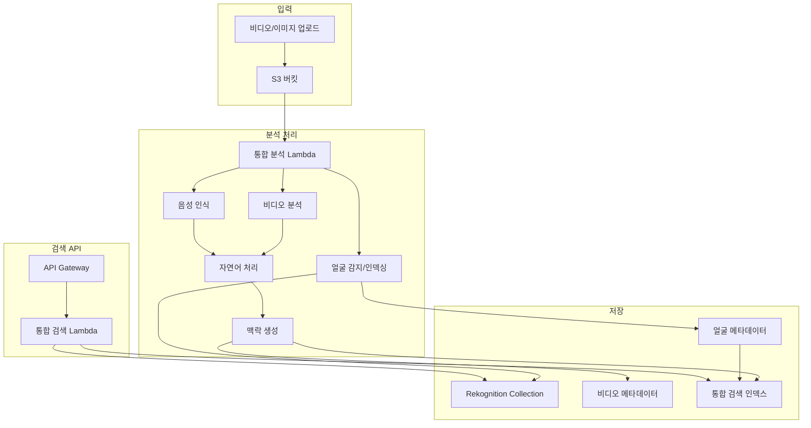

# Face Indexing + Video Understanding 통합 최소 구성 가이드

## 1. 통합 시스템 개요

Face Indexing과 Video Understanding을 결합하여 비디오에서 특정 인물을 찾고, 해당 인물이 등장하는 장면의 맥락을 이해할 수 있는 통합 시스템입니다.

### 1.1 핵심 기능
- **얼굴 인덱싱**: 비디오/이미지에서 얼굴 감지 및 인덱싱
- **비디오 맥락 분석**: 음성, 객체, 장면 분석
- **통합 검색**: "김철수가 나오는 회의 영상" 같은 복합 검색
- **시간 기반 검색**: 특정 인물이 등장하는 시점의 내용 검색

### 1.2 통합 아키텍처


## 2. CloudFormation 통합 템플릿

```yaml
AWSTemplateFormatVersion: '2010-09-09'
Description: 'Face Indexing + Video Understanding 통합 시스템'

Parameters:
  BucketName:
    Type: String
    Default: integrated-media-analysis
  CollectionId:
    Type: String
    Default: integrated-face-collection
  OpenSearchDomain:
    Type: String
    Default: integrated-search

Resources:
  # S3 버킷
  MediaBucket:
    Type: AWS::S3::Bucket
    Properties:
      BucketName: !Sub "${BucketName}-${AWS::AccountId}"
      NotificationConfiguration:
        LambdaConfigurations:
          - Event: s3:ObjectCreated:*
            Function: !GetAtt IntegratedAnalysisLambda.Arn
            Filter:
              S3Key:
                Rules:
                  - Name: suffix
                    Value: .mp4
                  - Name: suffix
                    Value: .jpg
                  - Name: suffix
                    Value: .png

  # DynamoDB 테이블들
  FaceIndexTable:
    Type: AWS::DynamoDB::Table
    Properties:
      TableName: !Sub "face-index-${AWS::StackName}"
      BillingMode: PAY_PER_REQUEST
      AttributeDefinitions:
        - AttributeName: faceId
          AttributeType: S
        - AttributeName: mediaId
          AttributeType: S
        - AttributeName: timestamp
          AttributeType: N
      KeySchema:
        - AttributeName: faceId
          KeyType: HASH
      GlobalSecondaryIndexes:
        - IndexName: mediaId-timestamp-index
          KeySchema:
            - AttributeName: mediaId
              KeyType: HASH
            - AttributeName: timestamp
              KeyType: RANGE
          Projection:
            ProjectionType: ALL

  VideoMetadataTable:
    Type: AWS::DynamoDB::Table
    Properties:
      TableName: !Sub "video-metadata-${AWS::StackName}"
      BillingMode: PAY_PER_REQUEST
      AttributeDefinitions:
        - AttributeName: mediaId
          AttributeType: S
        - AttributeName: timestamp
          AttributeType: N
      KeySchema:
        - AttributeName: mediaId
          KeyType: HASH
      GlobalSecondaryIndexes:
        - IndexName: timestamp-index
          KeySchema:
            - AttributeName: timestamp
              KeyType: HASH
          Projection:
            ProjectionType: ALL

  # OpenSearch 도메인
  OpenSearchDomain:
    Type: AWS::OpenSearch::Domain
    Properties:
      DomainName: !Sub "${OpenSearchDomain}-${AWS::StackName}"
      EngineVersion: OpenSearch_2.3
      ClusterConfig:
        InstanceType: t3.small.search
        InstanceCount: 1
      EBSOptions:
        EBSEnabled: true
        VolumeType: gp3
        VolumeSize: 20
      AccessPolicies:
        Version: '2012-10-17'
        Statement:
          - Effect: Allow
            Principal:
              AWS: !Sub "arn:aws:iam::${AWS::AccountId}:root"
            Action: "es:*"
            Resource: !Sub "arn:aws:es:${AWS::Region}:${AWS::AccountId}:domain/${OpenSearchDomain}-${AWS::StackName}/*"

  # Lambda 실행 역할
  LambdaExecutionRole:
    Type: AWS::IAM::Role
    Properties:
      AssumeRolePolicyDocument:
        Version: '2012-10-17'
        Statement:
          - Effect: Allow
            Principal:
              Service: lambda.amazonaws.com
            Action: sts:AssumeRole
      ManagedPolicyArns:
        - arn:aws:iam::aws:policy/service-role/AWSLambdaBasicExecutionRole
      Policies:
        - PolicyName: IntegratedAnalysisPolicy
          PolicyDocument:
            Version: '2012-10-17'
            Statement:
              - Effect: Allow
                Action:
                  - rekognition:*
                  - transcribe:*
                  - comprehend:*
                  - bedrock:InvokeModel
                  - dynamodb:*
                  - es:*
                  - s3:GetObject
                Resource: '*'

  # 통합 분석 Lambda
  IntegratedAnalysisLambda:
    Type: AWS::Lambda::Function
    Properties:
      FunctionName: !Sub "integrated-analysis-${AWS::StackName}"
      Runtime: python3.9
      Handler: index.handler
      Role: !GetAtt LambdaExecutionRole.Arn
      Timeout: 900
      Environment:
        Variables:
          COLLECTION_ID: !Ref CollectionId
          FACE_TABLE_NAME: !Ref FaceIndexTable
          VIDEO_TABLE_NAME: !Ref VideoMetadataTable
          OPENSEARCH_ENDPOINT: !GetAtt OpenSearchDomain.DomainEndpoint
      Code:
        ZipFile: |
          import json
          import boto3
          import os
          import uuid
          import requests
          from urllib.parse import unquote_plus
          from datetime import datetime

          rekognition = boto3.client('rekognition')
          transcribe = boto3.client('transcribe')
          comprehend = boto3.client('comprehend')
          bedrock = boto3.client('bedrock-runtime')
          dynamodb = boto3.resource('dynamodb')

          collection_id = os.environ['COLLECTION_ID']
          face_table = dynamodb.Table(os.environ['FACE_TABLE_NAME'])
          video_table = dynamodb.Table(os.environ['VIDEO_TABLE_NAME'])
          opensearch_endpoint = f"https://{os.environ['OPENSEARCH_ENDPOINT']}"

          def handler(event, context):
              for record in event['Records']:
                  bucket = record['s3']['bucket']['name']
                  key = unquote_plus(record['s3']['object']['key'])
                  media_id = str(uuid.uuid4())
                  
                  try:
                      file_extension = key.lower().split('.')[-1]
                      
                      if file_extension in ['jpg', 'jpeg', 'png']:
                          # 이미지 처리
                          process_image(bucket, key, media_id)
                      elif file_extension in ['mp4', 'mov', 'avi']:
                          # 비디오 처리
                          process_video(bucket, key, media_id)
                      
                      print(f"Started processing: {media_id}")
                      
                  except Exception as e:
                      print(f"Error processing {key}: {str(e)}")
              
              return {'statusCode': 200}

          def process_image(bucket, key, media_id):
              # 이미지에서 얼굴 인덱싱
              try:
                  response = rekognition.index_faces(
                      CollectionId=collection_id,
                      Image={'S3Object': {'Bucket': bucket, 'Name': key}},
                      ExternalImageId=media_id,
                      MaxFaces=10,
                      QualityFilter='AUTO',
                      DetectionAttributes=['ALL']
                  )
                  
                  # 얼굴 정보 저장
                  for face_record in response['FaceRecords']:
                      save_face_data(media_id, face_record, bucket, key, 0)
                  
                  # OpenSearch 인덱싱
                  index_media_data(media_id, {
                      'type': 'image',
                      'bucket': bucket,
                      'key': key,
                      'faceCount': len(response['FaceRecords']),
                      'timestamp': datetime.now().isoformat()
                  })
                  
              except Exception as e:
                  print(f"Error processing image {key}: {str(e)}")

          def process_video(bucket, key, media_id):
              # 비디오 얼굴 감지 시작
              face_job = rekognition.start_face_detection(
                  Video={'S3Object': {'Bucket': bucket, 'Name': key}},
                  ClientRequestToken=f"{media_id}-faces"
              )
              
              # 비디오 라벨 감지 시작
              label_job = rekognition.start_label_detection(
                  Video={'S3Object': {'Bucket': bucket, 'Name': key}},
                  ClientRequestToken=f"{media_id}-labels"
              )
              
              # 음성 인식 시작
              transcribe_job_name = f"transcribe-{media_id}"
              transcribe.start_transcription_job(
                  TranscriptionJobName=transcribe_job_name,
                  Media={'MediaFileUri': f"s3://{bucket}/{key}"},
                  MediaFormat='mp4',
                  LanguageCode='ko-KR'
              )
              
              # 초기 메타데이터 저장
              video_table.put_item(
                  Item={
                      'mediaId': media_id,
                      'bucket': bucket,
                      'key': key,
                      'type': 'video',
                      'timestamp': int(datetime.now().timestamp()),
                      'status': 'PROCESSING',
                      'faceJobId': face_job['JobId'],
                      'labelJobId': label_job['JobId'],
                      'transcribeJobName': transcribe_job_name,
                      'createdAt': datetime.now().isoformat()
                  }
              )

          def save_face_data(media_id, face_record, bucket, key, timestamp):
              face_id = face_record['Face']['FaceId']
              
              face_table.put_item(
                  Item={
                      'faceId': face_id,
                      'mediaId': media_id,
                      'bucket': bucket,
                      'key': key,
                      'timestamp': timestamp,
                      'confidence': face_record['Face']['Confidence'],
                      'boundingBox': face_record['Face']['BoundingBox'],
                      'attributes': face_record['FaceDetail'] if 'FaceDetail' in face_record else {},
                      'createdAt': datetime.now().isoformat()
                  }
              )

          def index_media_data(media_id, data):
              try:
                  response = requests.post(
                      f"{opensearch_endpoint}/media-index/_doc/{media_id}",
                      json=data,
                      headers={'Content-Type': 'application/json'}
                  )
                  print(f"OpenSearch indexing: {response.status_code}")
              except Exception as e:
                  print(f"OpenSearch indexing error: {e}")

  # 결과 처리 Lambda (비디오 분석 완료 후 호출)
  ResultProcessorLambda:
    Type: AWS::Lambda::Function
    Properties:
      FunctionName: !Sub "result-processor-${AWS::StackName}"
      Runtime: python3.9
      Handler: index.handler
      Role: !GetAtt LambdaExecutionRole.Arn
      Timeout: 900
      Environment:
        Variables:
          COLLECTION_ID: !Ref CollectionId
          FACE_TABLE_NAME: !Ref FaceIndexTable
          VIDEO_TABLE_NAME: !Ref VideoMetadataTable
          OPENSEARCH_ENDPOINT: !GetAtt OpenSearchDomain.DomainEndpoint
      Code:
        ZipFile: |
          import json
          import boto3
          import os
          import requests
          from datetime import datetime

          rekognition = boto3.client('rekognition')
          transcribe = boto3.client('transcribe')
          comprehend = boto3.client('comprehend')
          bedrock = boto3.client('bedrock-runtime')
          dynamodb = boto3.resource('dynamodb')

          collection_id = os.environ['COLLECTION_ID']
          face_table = dynamodb.Table(os.environ['FACE_TABLE_NAME'])
          video_table = dynamodb.Table(os.environ['VIDEO_TABLE_NAME'])
          opensearch_endpoint = f"https://{os.environ['OPENSEARCH_ENDPOINT']}"

          def handler(event, context):
              media_id = event.get('mediaId')
              if not media_id:
                  return {'statusCode': 400, 'body': 'mediaId required'}
              
              try:
                  # 비디오 메타데이터 조회
                  response = video_table.get_item(Key={'mediaId': media_id})
                  if 'Item' not in response:
                      return {'statusCode': 404, 'body': 'Media not found'}
                  
                  video_data = response['Item']
                  
                  # 분석 결과 수집
                  analysis_results = collect_analysis_results(video_data)
                  
                  # 얼굴 데이터 처리
                  process_face_results(media_id, analysis_results.get('faces', []))
                  
                  # 맥락 생성 및 인덱싱
                  context_summary = generate_context_summary(analysis_results)
                  index_complete_data(media_id, video_data, analysis_results, context_summary)
                  
                  # 상태 업데이트
                  video_table.update_item(
                      Key={'mediaId': media_id},
                      UpdateExpression='SET #status = :status, analysisResults = :results, contextSummary = :summary',
                      ExpressionAttributeNames={'#status': 'status'},
                      ExpressionAttributeValues={
                          ':status': 'COMPLETED',
                          ':results': analysis_results,
                          ':summary': context_summary
                      }
                  )
                  
                  return {'statusCode': 200, 'body': 'Processing completed'}
                  
              except Exception as e:
                  print(f"Error processing results: {str(e)}")
                  return {'statusCode': 500, 'body': str(e)}

          def collect_analysis_results(video_data):
              results = {}
              
              # 얼굴 감지 결과
              try:
                  face_response = rekognition.get_face_detection(JobId=video_data['faceJobId'])
                  results['faces'] = face_response['Faces']
              except:
                  results['faces'] = []
              
              # 라벨 감지 결과
              try:
                  label_response = rekognition.get_label_detection(JobId=video_data['labelJobId'])
                  results['labels'] = [{'name': l['Label']['Name'], 'confidence': l['Label']['Confidence'], 'timestamp': l['Timestamp']} for l in label_response['Labels']]
              except:
                  results['labels'] = []
              
              # 음성 인식 결과
              try:
                  transcribe_response = transcribe.get_transcription_job(TranscriptionJobName=video_data['transcribeJobName'])
                  if transcribe_response['TranscriptionJob']['TranscriptionJobStatus'] == 'COMPLETED':
                      transcript_uri = transcribe_response['TranscriptionJob']['Transcript']['TranscriptFileUri']
                      transcript_data = requests.get(transcript_uri).json()
                      results['transcript'] = transcript_data['results']['transcripts'][0]['transcript']
                      
                      # Comprehend 분석
                      if results['transcript']:
                          try:
                              comprehend_response = comprehend.detect_key_phrases(Text=results['transcript'], LanguageCode='ko')
                              results['keyPhrases'] = [phrase['Text'] for phrase in comprehend_response['KeyPhrases']]
                          except:
                              results['keyPhrases'] = []
              except:
                  results['transcript'] = ''
                  results['keyPhrases'] = []
              
              return results

          def process_face_results(media_id, faces):
              # 비디오에서 감지된 얼굴들을 컬렉션에 인덱싱
              for face in faces[:10]:  # 최대 10개 얼굴만 처리
                  try:
                      # 얼굴 이미지를 S3에서 추출하여 인덱싱하는 로직
                      # 실제 구현에서는 프레임 추출 후 얼굴 인덱싱 필요
                      timestamp = face.get('Timestamp', 0)
                      
                      # 임시로 얼굴 정보만 저장
                      face_table.put_item(
                          Item={
                              'faceId': f"video-face-{media_id}-{timestamp}",
                              'mediaId': media_id,
                              'timestamp': timestamp,
                              'confidence': face['Face']['Confidence'],
                              'boundingBox': face['Face']['BoundingBox'],
                              'createdAt': datetime.now().isoformat()
                          }
                      )
                  except Exception as e:
                      print(f"Error processing face: {e}")

          def generate_context_summary(analysis_results):
              prompt = f"""
              비디오 분석 결과를 바탕으로 내용을 요약해주세요:
              
              감지된 객체: {', '.join([l['name'] for l in analysis_results.get('labels', [])[:10]])}
              음성 내용: {analysis_results.get('transcript', '')[:500]}
              주요 키워드: {', '.join(analysis_results.get('keyPhrases', [])[:10])}
              얼굴 감지 수: {len(analysis_results.get('faces', []))}
              
              요약 (200자 이내):
              """
              
              try:
                  response = bedrock.invoke_model(
                      modelId='anthropic.claude-3-haiku-20240307-v1:0',
                      body=json.dumps({
                          'messages': [{'role': 'user', 'content': prompt}],
                          'max_tokens': 200,
                          'anthropic_version': 'bedrock-2023-05-31'
                      })
                  )
                  result = json.loads(response['body'].read())
                  return result['content'][0]['text']
              except:
                  return "비디오 분석이 완료되었습니다."

          def index_complete_data(media_id, video_data, analysis_results, context_summary):
              doc = {
                  'mediaId': media_id,
                  'type': video_data['type'],
                  'bucket': video_data['bucket'],
                  'key': video_data['key'],
                  'contextSummary': context_summary,
                  'transcript': analysis_results.get('transcript', ''),
                  'labels': [l['name'] for l in analysis_results.get('labels', [])],
                  'keyPhrases': analysis_results.get('keyPhrases', []),
                  'faceCount': len(analysis_results.get('faces', [])),
                  'timestamp': datetime.now().isoformat()
              }
              
              try:
                  response = requests.post(
                      f"{opensearch_endpoint}/media-index/_doc/{media_id}",
                      json=doc,
                      headers={'Content-Type': 'application/json'}
                  )
                  print(f"Complete data indexing: {response.status_code}")
              except Exception as e:
                  print(f"Complete data indexing error: {e}")

  # 통합 검색 Lambda
  IntegratedSearchLambda:
    Type: AWS::Lambda::Function
    Properties:
      FunctionName: !Sub "integrated-search-${AWS::StackName}"
      Runtime: python3.9
      Handler: index.handler
      Role: !GetAtt LambdaExecutionRole.Arn
      Environment:
        Variables:
          COLLECTION_ID: !Ref CollectionId
          FACE_TABLE_NAME: !Ref FaceIndexTable
          VIDEO_TABLE_NAME: !Ref VideoMetadataTable
          OPENSEARCH_ENDPOINT: !GetAtt OpenSearchDomain.DomainEndpoint
      Code:
        ZipFile: |
          import json
          import boto3
          import os
          import base64
          import requests

          rekognition = boto3.client('rekognition')
          dynamodb = boto3.resource('dynamodb')
          
          collection_id = os.environ['COLLECTION_ID']
          face_table = dynamodb.Table(os.environ['FACE_TABLE_NAME'])
          video_table = dynamodb.Table(os.environ['VIDEO_TABLE_NAME'])
          opensearch_endpoint = f"https://{os.environ['OPENSEARCH_ENDPOINT']}"

          def handler(event, context):
              try:
                  # 검색 타입 결정
                  search_type = event.get('queryStringParameters', {}).get('type', 'text')
                  
                  if search_type == 'face':
                      # 얼굴 이미지로 검색
                      return search_by_face(event)
                  elif search_type == 'text':
                      # 텍스트로 검색
                      return search_by_text(event)
                  elif search_type == 'integrated':
                      # 통합 검색 (얼굴 + 텍스트)
                      return integrated_search(event)
                  else:
                      return {
                          'statusCode': 400,
                          'body': json.dumps({'error': 'Invalid search type'})
                      }
                      
              except Exception as e:
                  return {
                      'statusCode': 500,
                      'body': json.dumps({'error': str(e)})
                  }

          def search_by_face(event):
              # 얼굴 이미지로 유사한 얼굴이 포함된 미디어 검색
              image_data = base64.b64decode(event['body'])
              
              try:
                  # Rekognition으로 얼굴 검색
                  response = rekognition.search_faces_by_image(
                      CollectionId=collection_id,
                      Image={'Bytes': image_data},
                      MaxFaces=20,
                      FaceMatchThreshold=70
                  )
                  
                  # 매칭된 얼굴들의 미디어 정보 조회
                  media_ids = []
                  for match in response['FaceMatches']:
                      face_id = match['Face']['FaceId']
                      face_response = face_table.get_item(Key={'faceId': face_id})
                      if 'Item' in face_response:
                          media_ids.append(face_response['Item']['mediaId'])
                  
                  # 미디어 정보 조회
                  results = []
                  for media_id in set(media_ids):
                      media_response = video_table.get_item(Key={'mediaId': media_id})
                      if 'Item' in media_response:
                          results.append(media_response['Item'])
                  
                  return {
                      'statusCode': 200,
                      'body': json.dumps({
                          'searchType': 'face',
                          'total': len(results),
                          'results': results
                      })
                  }
                  
              except Exception as e:
                  return {
                      'statusCode': 500,
                      'body': json.dumps({'error': f'Face search error: {str(e)}'})
                  }

          def search_by_text(event):
              # 텍스트로 비디오 내용 검색
              query = event.get('queryStringParameters', {}).get('q', '')
              
              search_body = {
                  'query': {
                      'multi_match': {
                          'query': query,
                          'fields': ['contextSummary^3', 'transcript^2', 'labels', 'keyPhrases^2'],
                          'type': 'best_fields',
                          'fuzziness': 'AUTO'
                      }
                  },
                  'highlight': {
                      'fields': {
                          'contextSummary': {},
                          'transcript': {}
                      }
                  },
                  'size': 20
              }
              
              try:
                  response = requests.post(
                      f"{opensearch_endpoint}/media-index/_search",
                      json=search_body,
                      headers={'Content-Type': 'application/json'}
                  )
                  
                  if response.status_code == 200:
                      results = response.json()
                      return {
                          'statusCode': 200,
                          'body': json.dumps({
                              'searchType': 'text',
                              'total': results['hits']['total']['value'],
                              'results': [hit['_source'] for hit in results['hits']['hits']]
                          })
                      }
                  else:
                      return {
                          'statusCode': 500,
                          'body': json.dumps({'error': f'Search failed: {response.status_code}'})
                      }
                      
              except Exception as e:
                  return {
                      'statusCode': 500,
                      'body': json.dumps({'error': f'Text search error: {str(e)}'})
                  }

          def integrated_search(event):
              # 얼굴 + 텍스트 통합 검색
              # 구현 예: "김철수가 나오는 회의 영상"
              query = event.get('queryStringParameters', {}).get('q', '')
              face_image = event.get('body')  # base64 encoded image
              
              results = []
              
              # 1. 텍스트 검색 결과
              text_results = search_by_text(event)
              if text_results['statusCode'] == 200:
                  text_data = json.loads(text_results['body'])
                  results.extend(text_data['results'])
              
              # 2. 얼굴 검색 결과 (이미지가 제공된 경우)
              if face_image:
                  face_results = search_by_face(event)
                  if face_results['statusCode'] == 200:
                      face_data = json.loads(face_results['body'])
                      results.extend(face_data['results'])
              
              # 중복 제거 및 점수 계산
              unique_results = {}
              for result in results:
                  media_id = result.get('mediaId')
                  if media_id not in unique_results:
                      unique_results[media_id] = result
                  # 중복된 경우 점수 증가 로직 추가 가능
              
              return {
                  'statusCode': 200,
                  'body': json.dumps({
                      'searchType': 'integrated',
                      'total': len(unique_results),
                      'results': list(unique_results.values())
                  })
              }

  # API Gateway
  IntegratedSearchApi:
    Type: AWS::ApiGateway::RestApi
    Properties:
      Name: !Sub "integrated-search-api-${AWS::StackName}"

  SearchResource:
    Type: AWS::ApiGateway::Resource
    Properties:
      RestApiId: !Ref IntegratedSearchApi
      ParentId: !GetAtt IntegratedSearchApi.RootResourceId
      PathPart: search

  SearchMethod:
    Type: AWS::ApiGateway::Method
    Properties:
      RestApiId: !Ref IntegratedSearchApi
      ResourceId: !Ref SearchResource
      HttpMethod: POST
      AuthorizationType: NONE
      Integration:
        Type: AWS_PROXY
        IntegrationHttpMethod: POST
        Uri: !Sub "arn:aws:apigateway:${AWS::Region}:lambda:path/2015-03-31/functions/${IntegratedSearchLambda.Arn}/invocations"

  # Lambda 권한들
  S3InvokePermission:
    Type: AWS::Lambda::Permission
    Properties:
      FunctionName: !Ref IntegratedAnalysisLambda
      Action: lambda:InvokeFunction
      Principal: s3.amazonaws.com
      SourceArn: !Sub "${MediaBucket}/*"

  ApiInvokePermission:
    Type: AWS::Lambda::Permission
    Properties:
      FunctionName: !Ref IntegratedSearchLambda
      Action: lambda:InvokeFunction
      Principal: apigateway.amazonaws.com
      SourceArn: !Sub "${IntegratedSearchApi}/*/*"

  # API 배포
  ApiDeployment:
    Type: AWS::ApiGateway::Deployment
    DependsOn: SearchMethod
    Properties:
      RestApiId: !Ref IntegratedSearchApi
      StageName: prod

Outputs:
  BucketName:
    Value: !Ref MediaBucket
  ApiEndpoint:
    Value: !Sub "https://${IntegratedSearchApi}.execute-api.${AWS::Region}.amazonaws.com/prod"
  CollectionId:
    Value: !Ref CollectionId
  OpenSearchEndpoint:
    Value: !GetAtt OpenSearchDomain.DomainEndpoint
```

## 3. 배포 및 설정

### 3.1 Rekognition Collection 생성
```bash
aws rekognition create-collection --collection-id integrated-face-collection
```

### 3.2 CloudFormation 배포
```bash
aws cloudformation create-stack \
  --stack-name integrated-media-analysis \
  --template-body file://integrated-template.yaml \
  --capabilities CAPABILITY_IAM
```

## 4. 사용 방법

### 4.1 미디어 업로드
```bash
# 이미지 업로드 (얼굴 인덱싱)
aws s3 cp person1.jpg s3://integrated-media-analysis-123456789012/

# 비디오 업로드 (통합 분석)
aws s3 cp meeting-video.mp4 s3://integrated-media-analysis-123456789012/
```

### 4.2 검색 API 사용

#### 텍스트 검색
```bash
curl -X POST "https://your-api-endpoint/prod/search?type=text&q=회의" \
  -H "Content-Type: application/json"
```

#### 얼굴 검색
```python
import requests
import base64

# 얼굴 이미지로 검색
with open('search_face.jpg', 'rb') as f:
    image_data = base64.b64encode(f.read()).decode('utf-8')

response = requests.post(
    'https://your-api-endpoint/prod/search?type=face',
    data=image_data,
    headers={'Content-Type': 'application/json'}
)

print(response.json())
```

#### 통합 검색
```python
# 텍스트 + 얼굴 통합 검색
response = requests.post(
    'https://your-api-endpoint/prod/search?type=integrated&q=김철수 회의',
    data=image_data,  # 선택사항
    headers={'Content-Type': 'application/json'}
)
```

## 5. 웹 인터페이스

```html
<!DOCTYPE html>
<html>
<head>
    <title>통합 미디어 검색</title>
    <style>
        .container { max-width: 1000px; margin: 0 auto; padding: 20px; }
        .search-section { margin: 20px 0; padding: 20px; border: 1px solid #ddd; }
        .result-item { border: 1px solid #ccc; margin: 10px 0; padding: 15px; }
        .face-upload { margin: 10px 0; }
    </style>
</head>
<body>
    <div class="container">
        <h1>통합 미디어 검색</h1>
        
        <!-- 텍스트 검색 -->
        <div class="search-section">
            <h3>텍스트 검색</h3>
            <input type="text" id="textQuery" placeholder="검색어 입력...">
            <button onclick="searchByText()">검색</button>
        </div>
        
        <!-- 얼굴 검색 -->
        <div class="search-section">
            <h3>얼굴 검색</h3>
            <input type="file" id="faceImage" accept="image/*" class="face-upload">
            <button onclick="searchByFace()">얼굴로 검색</button>
        </div>
        
        <!-- 통합 검색 -->
        <div class="search-section">
            <h3>통합 검색</h3>
            <input type="text" id="integratedQuery" placeholder="예: 김철수가 나오는 회의">
            <input type="file" id="integratedFace" accept="image/*" class="face-upload">
            <button onclick="integratedSearch()">통합 검색</button>
        </div>
        
        <div id="results"></div>
    </div>

    <script>
        const API_ENDPOINT = 'YOUR_API_ENDPOINT';

        async function searchByText() {
            const query = document.getElementById('textQuery').value;
            if (!query) return;

            try {
                const response = await fetch(`${API_ENDPOINT}/search?type=text&q=${encodeURIComponent(query)}`, {
                    method: 'POST'
                });
                const data = await response.json();
                displayResults(data.results, 'text');
            } catch (error) {
                console.error('텍스트 검색 오류:', error);
            }
        }

        async function searchByFace() {
            const fileInput = document.getElementById('faceImage');
            const file = fileInput.files[0];
            if (!file) return;

            const reader = new FileReader();
            reader.onload = async function(e) {
                const base64Data = e.target.result.split(',')[1];
                
                try {
                    const response = await fetch(`${API_ENDPOINT}/search?type=face`, {
                        method: 'POST',
                        body: base64Data
                    });
                    const data = await response.json();
                    displayResults(data.results, 'face');
                } catch (error) {
                    console.error('얼굴 검색 오류:', error);
                }
            };
            reader.readAsDataURL(file);
        }

        async function integratedSearch() {
            const query = document.getElementById('integratedQuery').value;
            const fileInput = document.getElementById('integratedFace');
            const file = fileInput.files[0];

            let body = null;
            if (file) {
                const reader = new FileReader();
                reader.onload = async function(e) {
                    body = e.target.result.split(',')[1];
                    await performIntegratedSearch(query, body);
                };
                reader.readAsDataURL(file);
            } else {
                await performIntegratedSearch(query, null);
            }
        }

        async function performIntegratedSearch(query, imageData) {
            try {
                const response = await fetch(`${API_ENDPOINT}/search?type=integrated&q=${encodeURIComponent(query)}`, {
                    method: 'POST',
                    body: imageData
                });
                const data = await response.json();
                displayResults(data.results, 'integrated');
            } catch (error) {
                console.error('통합 검색 오류:', error);
            }
        }

        function displayResults(results, searchType) {
            const resultsDiv = document.getElementById('results');
            resultsDiv.innerHTML = `<h3>${searchType} 검색 결과 (${results.length}개)</h3>`;

            results.forEach(result => {
                const resultDiv = document.createElement('div');
                resultDiv.className = 'result-item';
                resultDiv.innerHTML = `
                    <h4>미디어 ID: ${result.mediaId}</h4>
                    <p><strong>타입:</strong> ${result.type}</p>
                    <p><strong>파일:</strong> ${result.key}</p>
                    ${result.contextSummary ? `<p><strong>내용:</strong> ${result.contextSummary}</p>` : ''}
                    ${result.faceCount ? `<p><strong>감지된 얼굴 수:</strong> ${result.faceCount}</p>` : ''}
                    ${result.labels ? `<p><strong>객체:</strong> ${result.labels.join(', ')}</p>` : ''}
                `;
                resultsDiv.appendChild(resultDiv);
            });
        }
    </script>
</body>
</html>
```

## 6. 고급 기능

### 6.1 시간 기반 얼굴 검색
```python
def search_face_at_time(face_id, start_time, end_time):
    """특정 시간 범위에서 얼굴이 등장하는 구간 검색"""
    response = face_table.query(
        IndexName='mediaId-timestamp-index',
        KeyConditionExpression='mediaId = :mediaId AND #timestamp BETWEEN :start AND :end',
        ExpressionAttributeNames={'#timestamp': 'timestamp'},
        ExpressionAttributeValues={
            ':mediaId': face_id,
            ':start': start_time,
            ':end': end_time
        }
    )
    return response['Items']
```

### 6.2 얼굴 클러스터링
```python
def cluster_similar_faces():
    """유사한 얼굴들을 그룹핑"""
    # FAISS를 사용한 얼굴 임베딩 클러스터링 로직
    pass
```

## 7. 비용 최적화

### 7.1 예상 비용 (월 500개 비디오 + 1000개 이미지)
- **Rekognition**: ~$200 (얼굴 감지 + 비디오 분석)
- **Transcribe**: ~$50
- **Comprehend**: ~$20
- **Bedrock**: ~$30
- **OpenSearch**: ~$50
- **DynamoDB**: ~$20
- **Lambda**: ~$10

**총 예상 비용: ~$380/월**

### 7.2 비용 절약 방법
- 배치 처리로 API 호출 최적화
- 불필요한 분석 기능 비활성화
- OpenSearch 인스턴스 크기 조정
- DynamoDB TTL로 오래된 데이터 자동 삭제

이 통합 구성으로 **"김철수가 나오는 회의 영상"** 같은 복합적인 검색이 가능한 완전한 시스템을 구축할 수 있습니다.